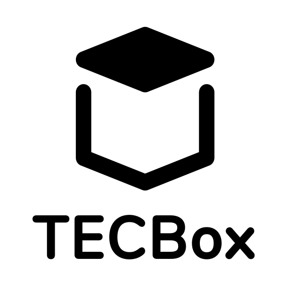
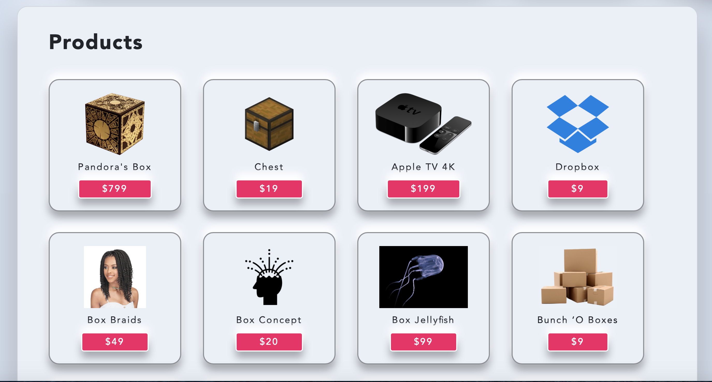
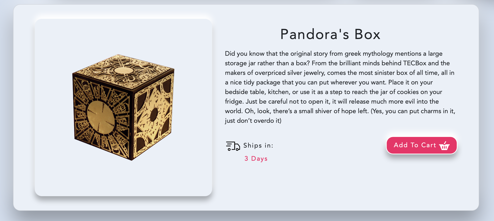
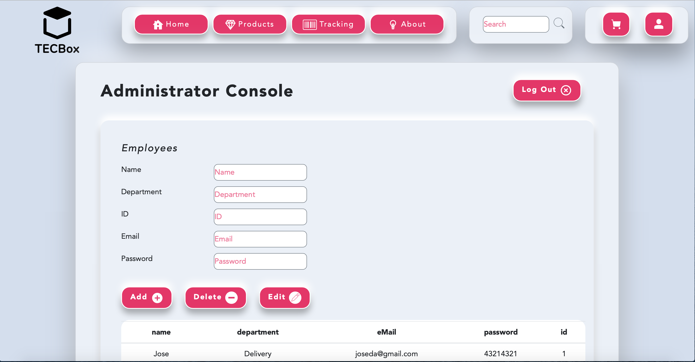
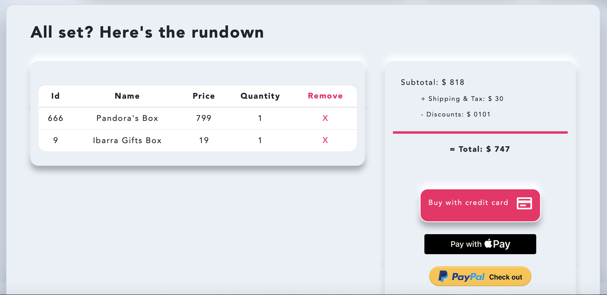
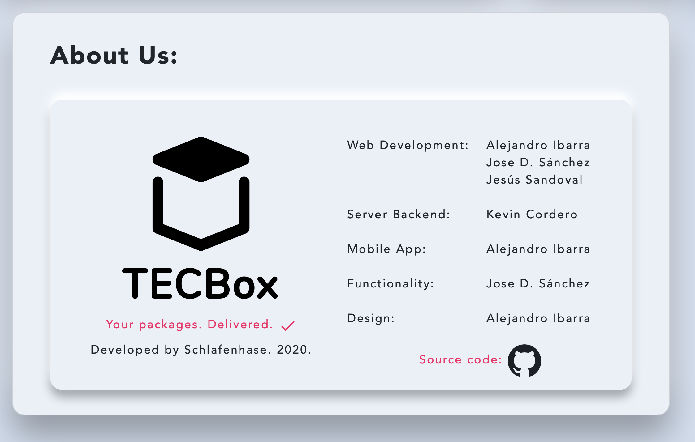
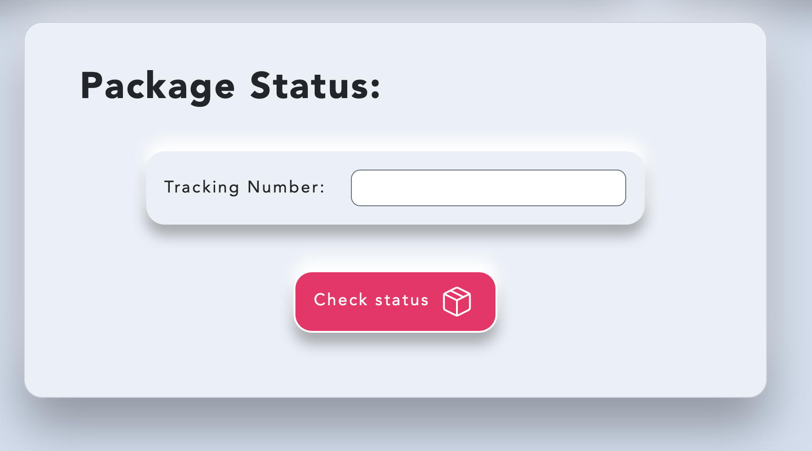
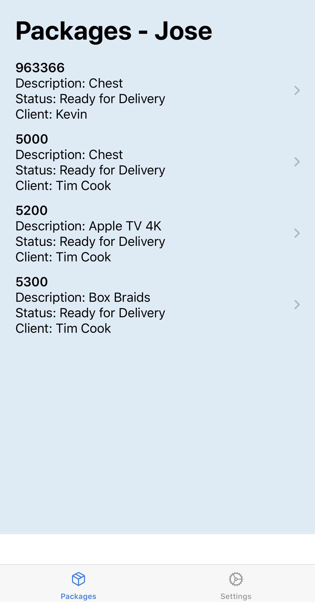
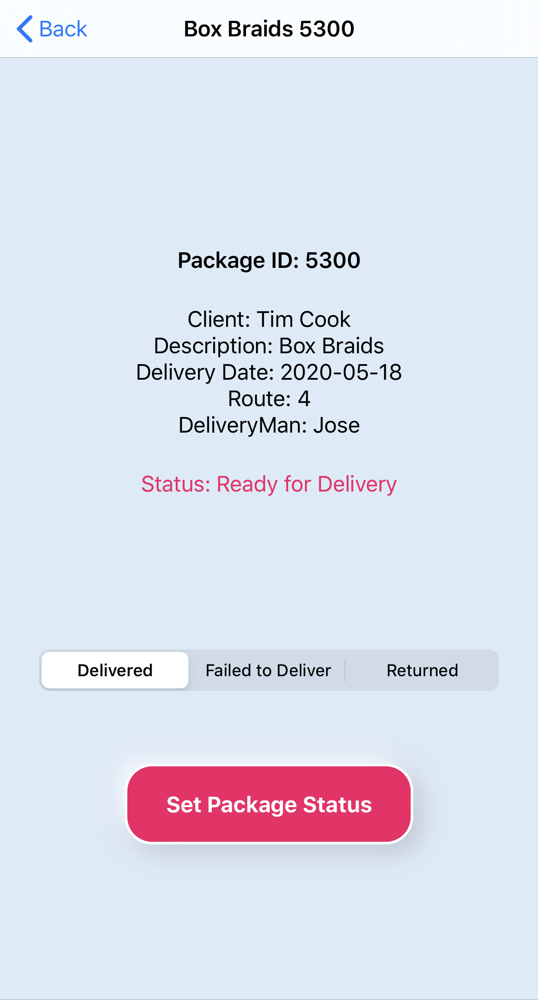

# TECBox 📦

<p align=center></p>

TECBox is a mockup of an online store that sells various types of boxes. It was built using **Angular** for the webpage,  **ASP .NET Core** as an API/Database and **SwiftUI** for a mobile app component. It's the first time we worked with those technologies, so it was a very great experience to learn a bit about the world of web development and its quirks.

## Photos 📷

Home                  |
:-------------------------:|
|

Products                        |Product Detail                      |
:------------------------------:|:------------------------------:
  |  

Administrator Console                       |Cart              |
:-------------------------:|:-------------------------:
  |  

About                       |Tracking              | Mobile App Package List         |Mobile App Package Detail |
:-------------------------:|:-------------------------:|:-------------------------:|:-------------------------:
  |   |   |  

## Getting Started 🚀

These instructions will get you a copy of the project up and running on your local machine for development and testing purposes.

### Prerequisites 👓

What things you need to install the software and how to install them

```
Webpage - Angular CLI version 9 or higher
API/Server - Visual Studio
Mobile app - Xcode 11.5 or higher
```

### Installing 💻

First, copy the repository on your local machine to get started. The **Web** folder contains all webpage data. Navigate to that directory using Terminal or the equivalent app in your operating system that can access Angular commands. Then, run the following:

```
npm i
```

This will install all required dependencies for the Angular web project, as denoted on the file "package.json". Once that's done, you may now run the local development server using the following command in the same directory.

```
ng serve
```

This will start the Angular development server associated with this project. You can access it at any browser, just type **localhost::4200** in the search bar. Be careful to not close the terminal window, as this will stop the server. You may also use Angular plugins in your IDE that allow you to run the previous terminal command. 

You can check out the general view of the store, but for the full experience you'll need to run the API. To do that, download Visual Studio (not Code) or any program that can open .sln server files and open **Server.sln** located in the **Server** folder. Start the server, this step depends on the program and operating system you're using. The .json files in the Database folder house all stored information.

Next, you'll need to disable cross-origin restrictions in your browser. Check your browser's documentation or search how to do this online. 
In Safari, it can be done by activating developer settings and going to **Develop -> Disable Cross-Origin Restrictions**.
In Chrome, there's an extension on the Chrome Web Store called **Allow CORS** that offers a quick shortcut.
Finally, the web app will update with the server information. Refer to the **Docs** folder for a detailed user guide and more information about usage.

Our tests were made on Windows and Mac computers running Angular 9 and Visual Studio for both parts at the same time.

#### iOS SwiftUI Mobile App 📱

We include a mobile app for deliverers to update their assigned package status quickly. It's built with Swift as an iOS standalone application. To get started, open the file **TECBox.xcworkspace** with Xcode 11.5 or higher. It uses CocoaPods for some features, but all pods are currently included in the repository, so there's no need to download them separately.

You need to replace the IP of the server in all of the Alamofire POST methods, located in the files **AppSession.swift** (Util folder), **PackageView.swift** (Views folder) and **PackageDetail.swift** (Views/Subviews folder) with the IP of your the machine the server is running on. If you're using a personal computer, then look for the IPv4 (this step dependes on your operating system). Make sure to have both devices connected to the same network.

Our tests were made on an iPhone 11 Pro Max running iOS 13.5. Xcode only works on macOS at this time.

## Built With 🛠

<table>
  <tr>
    <td>
      <p align=center></p>
    </td>
    <td>
      <p align=center></p>
    </td>
    <td>
      <p align=center></p>
    </td>
  </tr>
  
  <tr>
    <td>
      <p align=center><a href="https://www.angular.io/"><b>Angular</b></a>
      </br>Web Framework</p>
    </td>
    <td>
      <p align=center><a href="https://docs.microsoft.com/en-us/aspnet/core/?view=aspnetcore-3.1"><b>ASP .NET Core</b></a>
      </br>API & Database</p>
    </td>
    <td>
      <p align=center>
        <a href="https://developer.apple.com/xcode/swiftui/"><b>SwiftUI</b></a>
      </br>Mobile App<br>Language and Framework</p>
    </td>
  </tr>
</table>

## Docs 📖

Refer to the [**Docs**](https://github.com/AlejandroIbarraC/TECBox/tree/master/Docs) folder at the root of the project for more information about usage and organization.

## Authors 👨🏻‍💻

* **Kevin Cordero** - *Lead Developer on Back-end and Connections* - [Skryfall](https://github.com/Skryfall)
* **Alejandro Ibarra** - *Lead Designer. Mobile App Developer* - [AlejandroIbarraC](https://github.com/AlejandroIbarraC)
* **Jose D. Sánchez** - *Functionality Manager & Web Developer* - [JoseDavidSS](https://github.com/JoseDavidSS)
* **Jesús Yamir Sandoval** - *Project Manager & Web Developer* - [shuzz22260427](https://github.com/shuzz22260427)

## License 📄

This project is licensed under the MIT License - see the [LICENSE.md](LICENSE.md) file for details

## Acknowledgments 📎

* Medium article [Neumorphism the right way — A 2020 Design Trend ](https://medium.com/@artofofiare/neumorphism-the-right-way-a-2020-design-trend-386e6a09040a)
* Costa Rica Institute of Technology
* MP

<p align="center">
  
</p>
```
